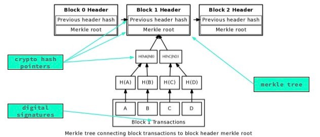

# Redefining Permissionless for Proof of Stake Blockchains
The Byzantine Generals Problem describes the problem of achieving distributed agreement over a compromised communications network. 
> "making a reliable system from unreliable parts"

Relevant: [A Guide to 99% Fault Tolerant Consensus](https://vitalik.ca/general/2018/08/07/99_fault_tolerant.html), [Finality in Blockchain Consensus](https://medium.com/mechanism-labs/finality-in-blockchain-consensus-d1f83c120a9a)

**Blockchain Review** <br>
(https://medium.com/mechanism-labs/finality-in-blockchain-consensus-d1f83c120a9a)

More information on Blockchain Design => [Ethereum Design Rationale](https://github.com/ethereum/wiki/wiki/Design-Rationale)

Practical Byzantine Fault Tolerance is a consensus mechanism that enables distributed consensus even in an asynchronous systems. It utilizes a system in which there's one leader and many subordinate nodes. Each round (*view*) of pBFT consensus is broken down into 4 phases:
1. A client sends a request to a leader node to invoke a service operation.
2. The leader node multicasts the request to the backup nodes.
3. The nodes execute the request and then send a reply to the client.
4. The client awaits f+1 (f represents the maximum number of nodes that may be faulty) replies from different nodes with the same result.

Bitcoin provides a probabilistic solution to the Byzantine Generals Problem. It creates an interactive game in which miners come to agreement on the order of transactions. The consensus mechanism utilizes probabilistic payoffs coupled with a native token to incentivize loyalty to the network (among miners).

Bitcoin's incentive model is designed to ensure that mining is a long-term investment in the network that does not guarantee short-term profits. The reward schedule offers a probabilistic guarantee that a miner will be rewarded based on the relative amount of hashpower that expend to solve the proof of work puzzle. 

The probabilistic reward schedule is represented in the following equation: 
```
mean time to next block reward = 10 minutes / (miner percent of total network hashpower)
```
This means that if you are contributing 0.1\% of the total network hashpower, you'll find a block every 10,000 minutes (almost once a week).

This reward schedule ensures the following properies with respect to the amount of time each miner waits between finding blocks:
1. high average amount of time (between finding blocks)
2. the variance of the time between blocks is also very high

> Draw a parallel to lotteries and explain how this incentive model coupled with a native token is great for building long-term incentives, but establishing a native token does carry significant community onboarding costs that aren't necessary for many projects at the application level. 
Reminder on gatekeepers and how we aren't really autonomous agents on the internet. Introduce and steal the baby analogy frm Gavin Would.
> get to the next point through engagement with the class
> What are the nice properties? It is deterministic and fair, yet it also requires significant time invested and essentially a long-term belief in the network. It is NON-MANIPULATEABLE...you can't predict who is going to win next and you can't tell if you're going to win next; it's like a random selector based on the amount of work that you contribute and anyone can join at any time and start contributing
> some cons: resource waste? is it waste or it a cost?
> ASICs => centralization (Mimblewimble uses Cuckoo based hashing, Handshake considered it)

---

Can we solve electricity? How can I guide them towards round robin consensus? Try and guide them towards the random block proposer model; how do we generate randomness? How do we ensure people stay online? Are we redefining permissionless if we punish for unavailability? Also how dynamic are dynamic validator sets?

Now, let's think about tradeoffs?

So how do these really look? There are high capital requirements and they are centralized. In practice, these have not been figured out. Even so, they seem to be the only way Ethereum can scale transaction throughput and that's what it's trying to do. We said that decentralized => trustless so ethereum wants both; the question is can they get both? 

How does proof of stake get economic finality? [punitive slashing](https://blog.ethereum.org/2014/01/15/slasher-a-punitive-proof-of-stake-algorithm/)

[Randomness considerations in PoS](https://vitalik.ca/files/randomness.html)

**Interested in the Cryptography behind PoS blockchains?**<br>
* [The latest gossip on BFT Consensus](https://arxiv.org/pdf/1807.04938.pdf) -- 7/13/2018; Tendermint
* [Polkadot: Vision for A Heterogeneous Multi-Chain Framework](http://www.pmg.csail.mit.edu/papers/bft-tocs.pdf) -- Gavin Wood, Parity
* Classics: [Consensys in the Presence of Asynchrony](https://groups.csail.mit.edu/tds/papers/Lynch/jacm88.pdf), [Practical Byzantine Fault Tolerance](http://pmg.csail.mit.edu/papers/osdi99.pdf), [PBFT and proactive recovery](http://www.pmg.csail.mit.edu/papers/bft-tocs.pdf)

I think the two leaders on this front are Cosmos/Tendermint and Polkadot. Tendermint/Cosmos are coding in Golang and Polkadot is coding in Rust. Tezos is coming out soon and it will be coded in Ocaml. Consider writing a blog post on organizing knowledge in this space based on languages and how WASM should change a lot, but declarative syntax is generally the way to go for these blockchain applications. I think Rust has a lot of useful properties and so does Golang.


## Tradeoffs

As we know it today, distributed computing in a permissionless setting maintains certain limitations with respect to decentralization, scalability, and security (/privacy).Specifically, the trilemma states that blockchain systems can have at most two of the following three defined properties:

1. **Decentralization**: the system is able to run in a scenario where each participants only have access to O(c) resources, i.e. regular laptop or small VPS.
2. **Scalability**: the ability to process O(n) > O(c) transactions.
3. **Security**: secure against attackers with up to O(n) resources <br>
[Ethereum Sharding FAQ](https://github.com/ethereum/wiki/wiki/Sharding-FAQs)

Attempts to solve this trilemma often sacrifice either security/privacy or decentralization in order to increase transaction throughput (*to scale*).


Let's also consider layer 2 scaling solutions. For next time, maybe! But put a slide with all of these things taken under consideration. Value of creating nice graphics is in the fact that this is a book eventually (consider using the Rust markdown tool for generating the book; don't use gitbooks because this limits editability in markdown).


<!-- Extra secret reading: [here](https://medium.freecodecamp.org/a-comprehensive-guide-to-coding-a-blockchain-powered-online-community-f938792dbcb4) -->

## Other References
* [Consensus Compare: Casper vs. Tendermint](https://blog.cosmos.network/consensus-compare-casper-vs-tendermint-6df154ad56ae) -- 11/16/2017; Interchain Foundation (*related* to Tendermint)