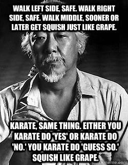

# Application Development

Application Development is split up into a few different sections based on language. This document contains justifications for studying each language as well as resources for getting started in each language. 
* [Rust](#rust)
* [Go](#go)
* [JavaScript](#javascript)
* [Python](#python)

> Resources are grouped according to language in ```./language``` and each directory contains a ```schedule.md``` that provides a high level overview of the readings/themes for each week.

> We recommend only learning **one language at a time**. At least at first this will enable you to master one language and feel accomplished before moving on to the next one. With these things, it is much more valuable to have attained mastery of one language than to know a little about many languages (*jack of all trades, master of none*)

## What is this??
Think of it like the gym for programming. We give you a *workout* schedule with programming assignments and relevant reading. To get started, email ars9he@virginia.edu with a brief introduction and why you're interested.

Just like the gym, learning new programming languages requires discipline and consistency. If you're going to do this, then you need to commit some amount of time to it every day.



Each of the Application Development programs are 6-12 week programs designed to enable students to develop applications in the relevant programming languages **in the context of blockchain applications**. The curriculum is very malleable; where we start and how far we go entirely depends on the student.

## Rust
Rust offers [A LOT](https://paritytech.io/why-rust/) of desirable features that make it a very good programming language for blockchains. In addition, [Parity](https://www.parity.io/technologies/) is coding their software stack in Rust (both their blockchain clients and the [Polkadot network](https://polkadot.network)). For our purposes, we'll build Rust blockchain applications using Parity/Polkadot.

> Check out the [schedule](Rust/schedule.md) for more information

## Go
Go was designed by Google for Web servers and Networking with very good concurrency support. There are many useful libraries for blockchain interaction that are coded in Go. We'll focus on developing with both the [Loom Golang SDK](https://loomx.io/developers/docs/en/go-loom-clients.html) as well as [Tendermint](https://github.com/tendermint). Both of these clients offer scalability over many existing blockchain implementations.

> Check out the [schedule](Go/schedule.md) for more information

## JavaScript
> [The Birth & Death of JavaScript](https://www.destroyallsoftware.com/talks/the-birth-and-death-of-javascript) <br>
JavaScript is still a very popular programming language, especially for front-end web applications. Despite its [humble](https://en.wikipedia.org/wiki/JavaScript) beginnings, JavaScript can be used for almost anything nowadays. For our purposes, we'll focus on developing with [AragonOS](https://github.com/aragon/aragonOS), but we may experiment with [other](https://github.com/counterfactual/contracts/blob/develop/ARCHITECTURE.md) libraries. In addition, we will probably also cover **[Solidity](https://solidity.readthedocs.io/en/v0.4.25/), which has very similar syntax**.

> Check out the [schedule](JavaScript/schedule.md) for more information

## Python
There are many good [reasons](https://hackernoon.com/reasons-to-choose-python-for-ai-based-projects-7e3e6c8b954a) to code in Python. This track will emphasize data science and may focus on interacting with [BigChainDB](https://github.com/bigchaindb/bigchaindb). 

> Check out the [schedule](Python/schedule.md) for more information. This track is still under construction.